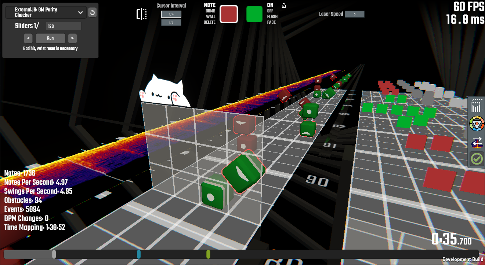

# ChroMapper Error Checker

Simple plugin that adds an error checker to [ChroMapper](https://github.com/Caeden117/ChroMapper)

### Installation

Download the latest release, place the entire folder in your `ChroMapper/Plugins` directory

### Built-in plugins

- Vision Blocks
  - Copy of the logic in MMA2's error checker
  - Finds blocks that are obscured by blocks in the center two positions
- Stacked Blocks
  - Finds blocks that may be overlapping
  - Looks for notes less than 0.1 beats of each other in the same position

### JS Checks

You can add more error check types directly by placing javascript files in the same directory as the plugin.

The parser uses [Jint 3 (beta)](https://github.com/sebastienros/jint/issues/343) and [esprima](https://github.com/sebastienros/esprima-dotnet) which can parse ES6 but not all features are supported, for instance esprima can parse `class` but Jint will throw an exception so you'll have to rewrite these as old-style functions and prototypes

As this is essentially alpha the interface for these checks may change but for now you just need to create a block similar to:

```
module.exports = {
	name: "My error check",
	params: {"Min Time": 0.24},
	run: function(cursor, notes, events, walls, _, global, data, customEvents, bpmChanges)
};
```

- **name** appears in the drop-down ingame.
- **params** is an object, for each key a text field will be show to the user where they can enter a value which will be passed to you as a float
- **run** is a function that will be called when the user runs your check, this is currently designed to be compatible with MM scripts, you just need to add the name and params.
  - **cursor** is the position the user is looking at in the map
  - **notes** is an array of notes ordered by time (I can't guarantee what order notes that happen at the same time will be in for now) which can be modified. You can directly modify the values of notes in the array with code like `notes[0]._time = 10;`
    OR if you want to generate a fresh array you need to provide your new array in object returned from your function (see below)
  - **events** are provided next and work the same as notes
  - **walls** are last of the map objects and work the same as notes
  - **\_** In MM scripts the parameter here was called save? I don't know what it did but this parameter is just an empty object and has no use. Provided for compatibility.
  - **globals** can be used to persist data between runs of your script, it will be unchanged on future invocations. It also includes a `params` array which contains the values set for your params. (I _assume_ this will be returned in order)
  - **data** has information about the map, currently the list of data is as follows:
    - currentBPM - The bpm at the cursor accounting for BPM changes
    - songBPM - The bpm of the song
    - NJS - The note jump speed set for the song
    - offset - How far into the song the user starts
    - characteristic - Current beatmap characteristics
    - difficulty - Current beatmap difficulty
    - environment - Current beatmap environment
    - version - Current beatmap version
  - **customEvents** are custom objects used for [noodling](https://github.com/Aeroluna/NoodleExtensions/blob/master/Documentation/AnimationDocs.md#custom-events)
  - **bpmChanges** may be useful for working out what the bpm is at a point in a map or programatically creating slides
  - **bombs** - v3
  - **arcs** - v3
  - **chains** - v3

Two functions will be defined before calling `performCheck`

- **addError**(note, reason) - Pass back the problem note object, all it's properties (except `_customData`) must match the original passed note for it to be marked properly and you can provide a reason as the second parameter
- **addWarning**(note, reason) - The same as `addError` except the note will only be highlighted yellow

[There are example scripts in Examples](Examples)


